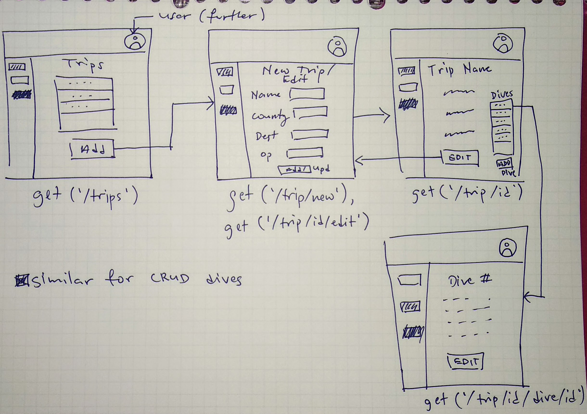
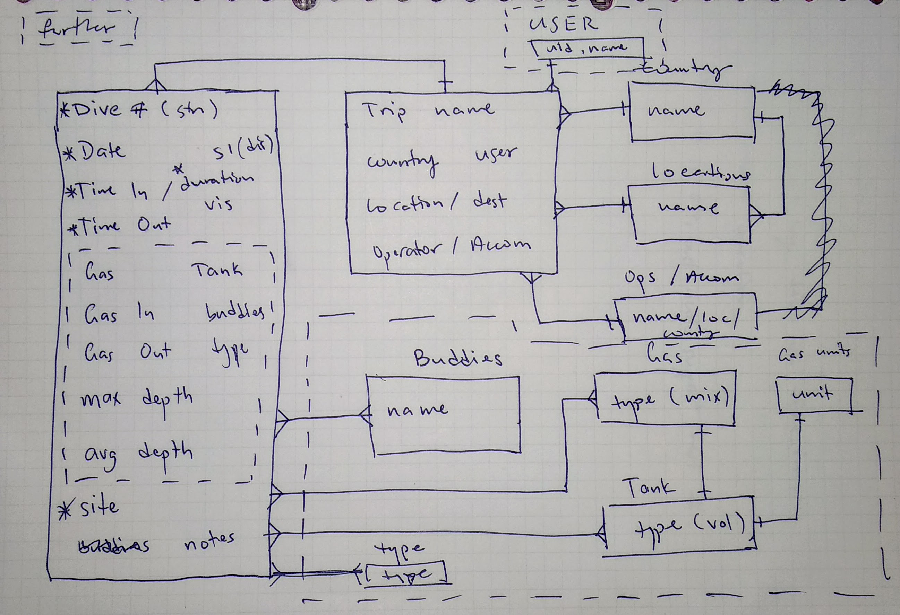

# DIVE DIVE DIVE (dive3) - a dive log

## Technologies

1. Node
2. Express
3. PostgreSQL
4. HTML/CSS/JavaScript
5. React Views for Express
6. Cloudinary API

## Approach
I started with a basic idea of wanting to show the dives in a format somewhat different from a physical dive book, and eventually settled on the trips/dives hierarchy, plus the idea of laying out dives as cards. The relational diagram and basic wireframe are below.

### User stories
``` text
As a [diver with many dives], I want to be able to
  log dives from a simple interface
so that
  logging dives isn't such a chore.

As a [lazy diver], I want to be able to
  log only the essential details if I don't have the rest
so that
  I can log dives even if I don't have detailed information.

As a [diver who goes on many trips], I want to be able to
  log dives as belonging to a trip
so that
  I can revisit a trip and reminisce.

```

### Wireframe


### ERD


## Install
Access online at http://dive3.herokuapp.com/

## Unsolved / Future Features
I'd have liked to add something along the lines of statistic visualisations for dives, as well as a feature (suggested by a dive buddy) of allowing buddies or divemasters to sign dives off digitally.

## Credits
Smali Kazmi for [detect-mobile-browser](https://github.com/smali-kazmi/detect-mobile-browser): script for detecting access from a mobile device.
